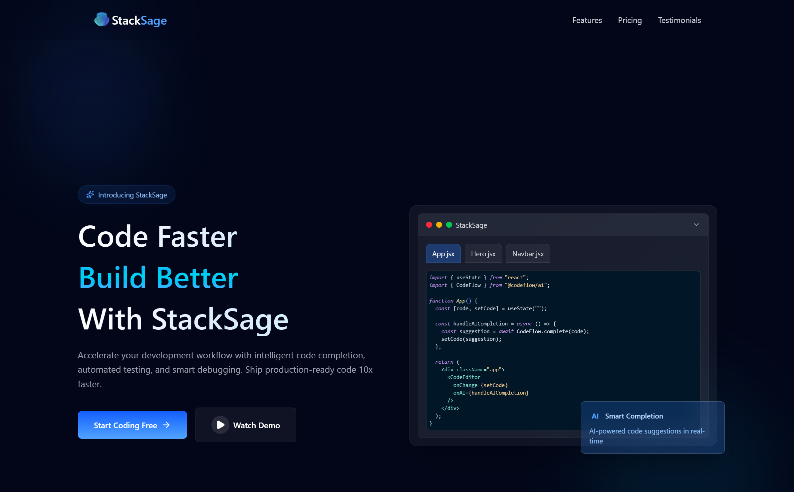

# StackSage

 Fully Responsive Modern Website using ReactJS and Tailwind CSS

## Features

- **Modern Design**: Sleek and intuitive user interface.
- **Responsive Layout**: Optimized for all devices, from mobile to desktop.
- **SEO Friendly**: Built with search engine optimization in mind.
- **Fast Performance**: Utilizes ReactJS for efficient rendering.
- **Customizable**: Tailwind CSS for easy styling and customization.

## Technologies Used
- ReactJS
- Tailwind CSS
- TypeScript (ES6+)
- HTML5 & CSS3

